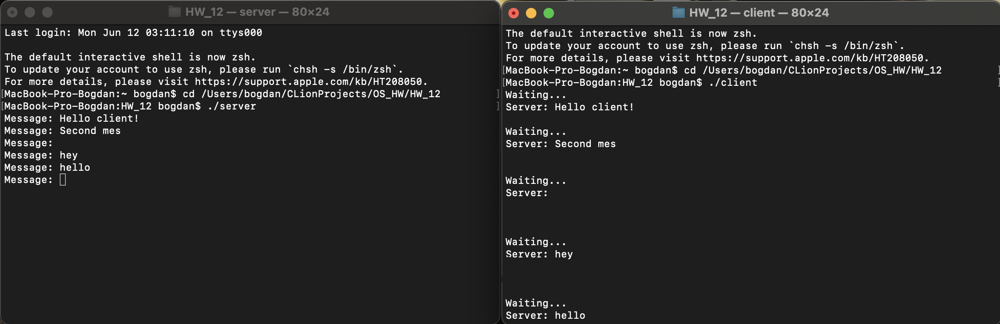

# Условие
Разработать клиент-серверное приложение, использующее UDP и реализующее широковещательную рассылку множества сообщений с сервера. Сообщения с сервера в цикле набираются в консоли и передаются клиентам, запущенным на разных компьютерах.

Решение достаточно реализовать на локальной сети. Завершение работы сервера и клиентов в данном случае не оговаривается.
# Запуск программы
Сервер выполняет отправку (широковещательную передачу) сообщений путем выполнения следующих действий:
- создание UDP-сокета с помощью функции socket()
- включение возможности широковещательной передачи в этом сокете с помощью функции setsockopt()
- подготовка адреса и бесконечный цикл, использующий функцию sendto() для отправки сообщений.

Клиент выполняет получение сообщений следующим образом: 
- создание UDP-сокета с помощью функции socket()
- привязка сокета к указанному порту и адресу с помощью функции bind(), и вход в бесконечный цикл recvfrom().

